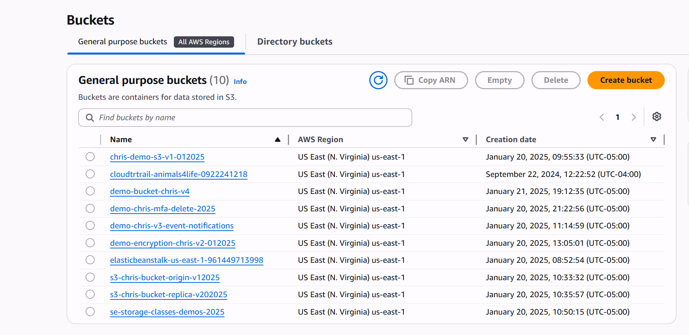
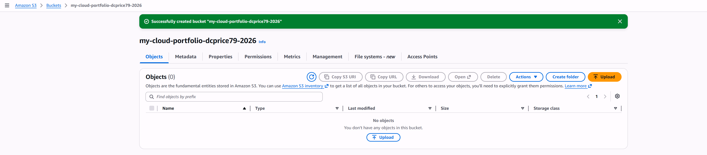
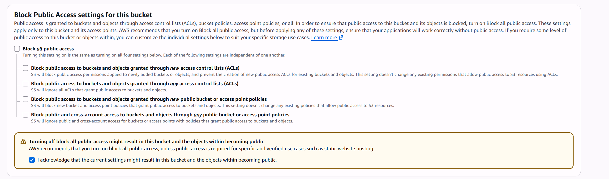
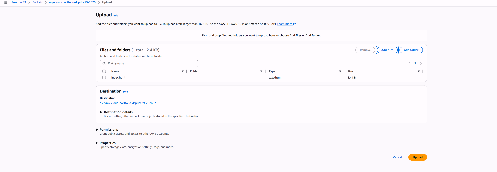
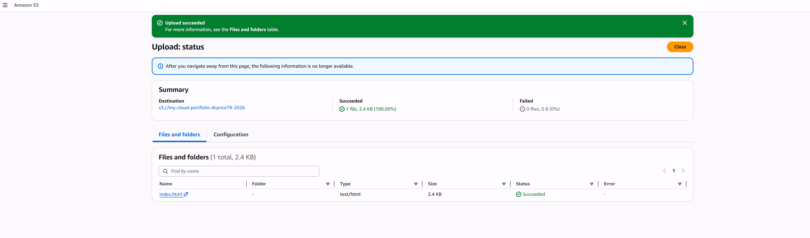
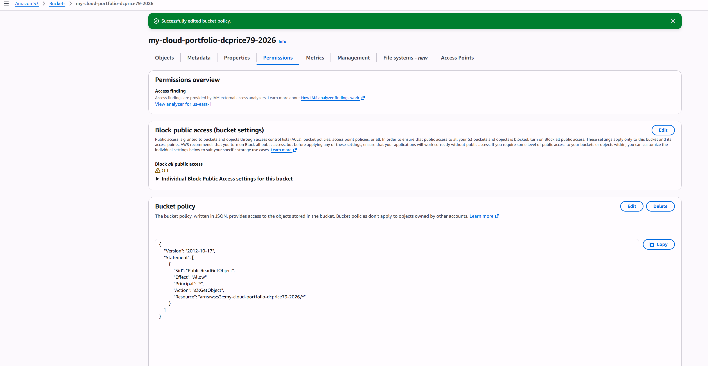
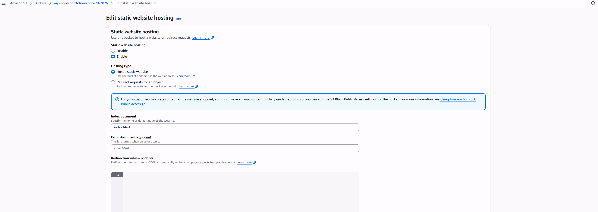
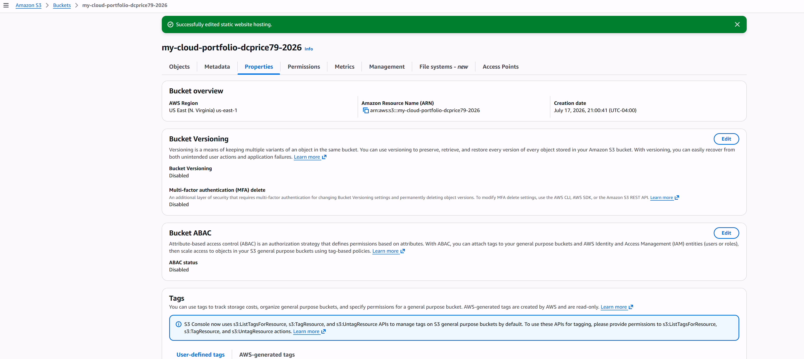
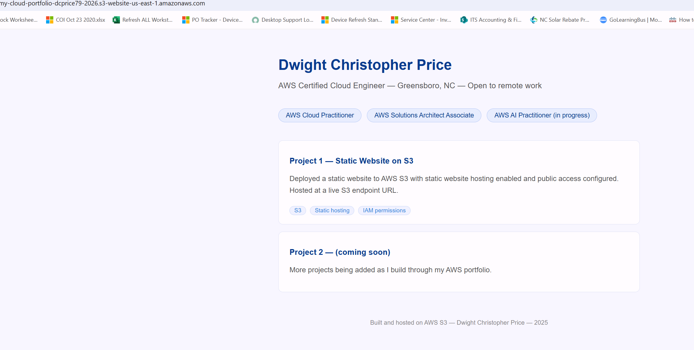

Project 1: Static Website Hosted on AWS S3

Deployed a personal portfolio website to AWS S3 using static
website hosting. Configured bucket permissions, applied a public
read bucket policy, and enabled S3 static website hosting.

Live URL: (http://my-cloud-portfolio-dcprice79-2026.s3-website-us-east-1.amazonaws.com)

Services used: Amazon S3, IAM bucket policies
Skills demonstrated: Cloud storage, access control, static
website hosting, AWS console navigation

## Screenshots

